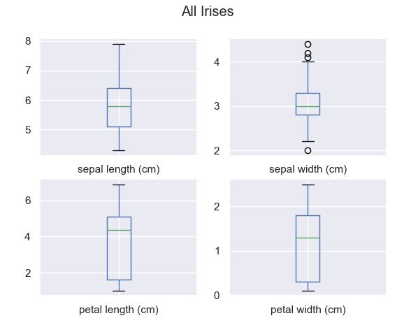
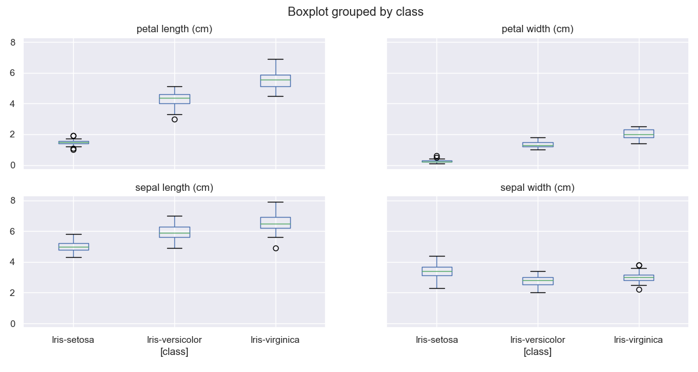
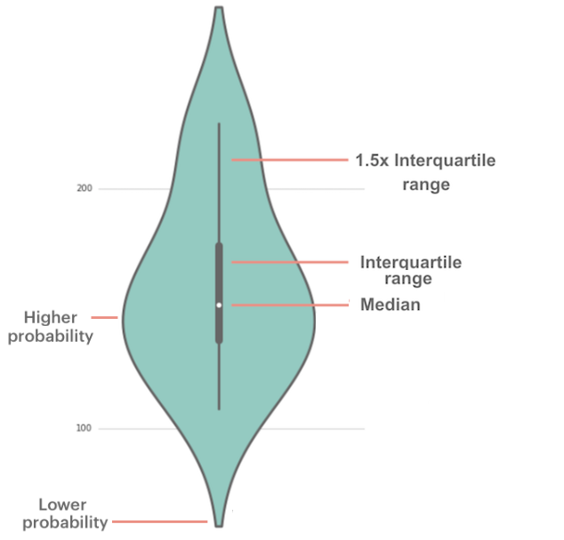
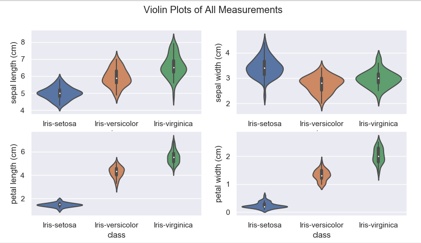
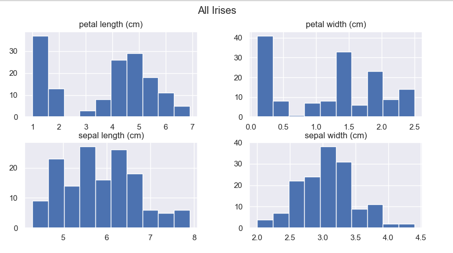
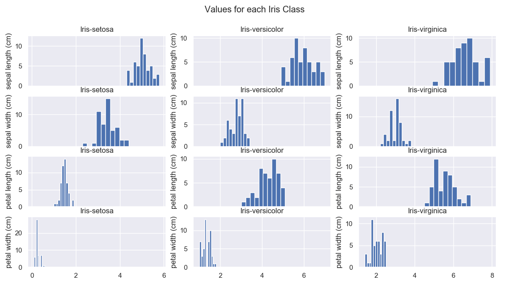
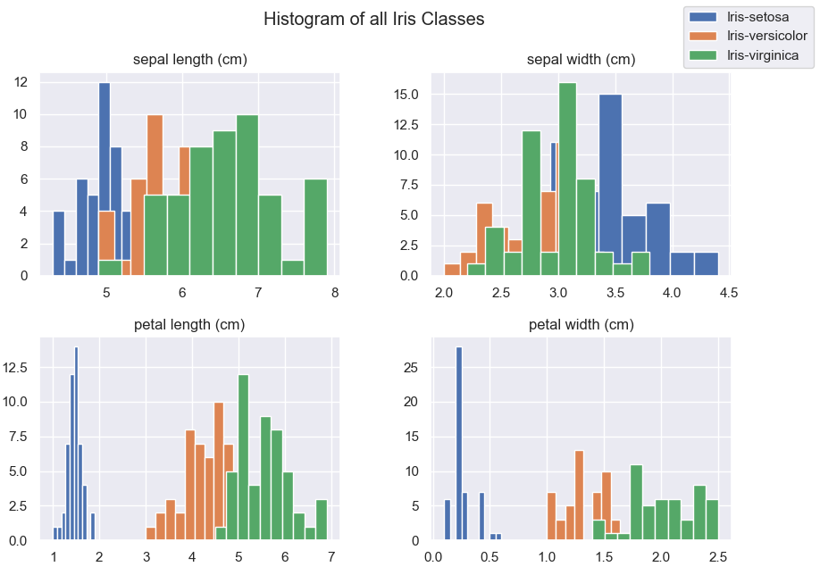
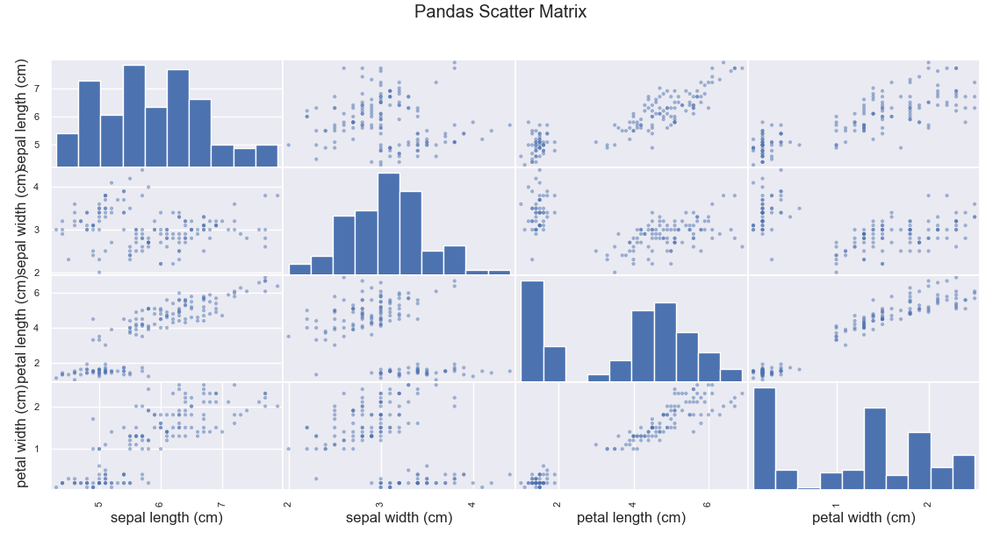
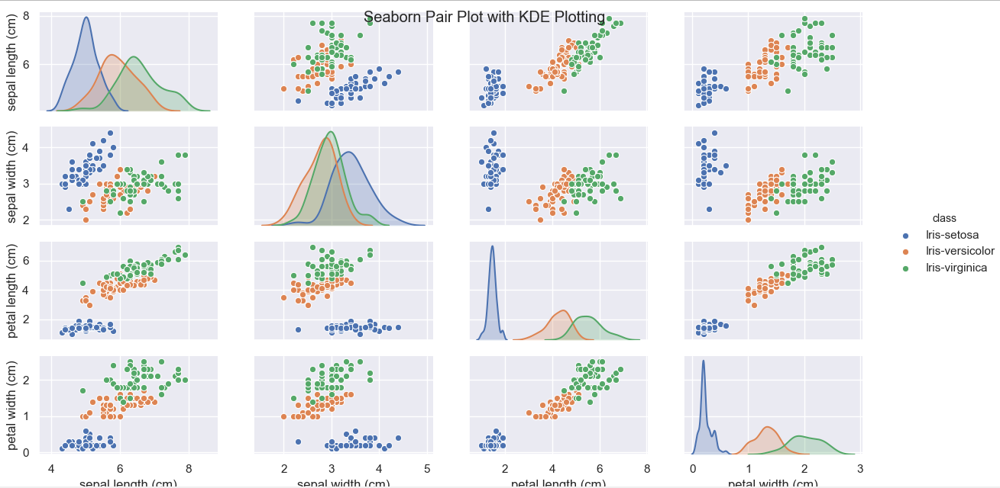

                                 

# Programming &amp; Scripting Fishers Iris Dataset Project Semester 1 2019 #

___________________________________________

**Module Name**: Programming & Scripting  
**Module Number**: 52445  
**Student Name**: Yvonne Brady  
**Student ID**: G00376355  
___________________________________________

| No | Instructions                                                                                       |
|----|----------------------------------------------------------------------------------------------------|
| 1  | Download the repository.                                                                           |
| 2  | Ensure python and all associated libraries are installed on your machine.                          |
| 3  | To run the program type the following the int command Line Interface:   ```python run menu.py```   |
| 4  | Follow instructions as per menus.                                                                  |

## 1. The Background ##

In 1936 Robert Fisher published a paper _The use of multiple measurements in taxonomic problems as an example of linear discriminant analysis_ introducing the now famous Iris Data Set. This data set comprises the width and length measurements of the sepals and petals of three different Iris varieties. 50 samples of each variety were collected on the same day, by the same person (Edgar Anderson) and measured using the same instruments. As it was Anderson who actually collected the flowers from the Gaspé Penninsula in Canada, this dataset is sometimes called the Anderson Data Set.

The dataset comprises of 150 records each containing 5 no attributes - each of the petal and sepal measurements and also the variety of Iris the measurements related to. This dataset is widely used as a reference for Data Analytics amd Machine Learning see the references section below for a small subset of the analysis performed on this dataset. As part of this project I have reviewed each of the references listed.


### 1.1 The Project Brief ###

The following project concerns the well-known Fisher’s Iris data set. The project entails you researching the data set, and then writing documentation and code in the Python programming language based on that research.

## 2. Initial Exploration ##

Initial exploration of the dataset consisted of finding out about the data in broad terms. A number python commands helped in getting an overall feel for the data:

### 2.1 Data Familiarisation ###

Firstly, to get an idea of the size and shape of the dataset the following command can be run:


```python
data.shape
```  


As can be seen from the results of this command, the dataset comprises 150 rows each with five attributes. This is no indication at this stage whether all attributes are populated. Now lets look a bit more at at data using the data.info() command.

```python
data.info()
```


The data.info() command showed that there are 150 entries in the dataset, each with 5 columns. Of the five columns, four are numeric in nature (floating point) reflecting the sepal and petal length and width measurements respectively. The fifth column "class" is of data type object.

```python
data.head()
```


The data.head() command gives a flavour of the data contained in the dataset, returning the first five rows worth of data. This snippet of the data shows us that these numbers are similar in size for each attribute and all are for the class Iris-setosa.

```python
data.tail()
```

  

The data.tail() command displays the last five rows. Here we see a little more variation in each of the values, but all are still within the same order of magnitude. As with the data.head() command, there is only one class identified in this snippet of the dataset, but this time it is the Iris-virginica. It would appear likely from the last two commands that the dataset is ordered by class, but this is by no means proven.

```python
data.sample(5)
```

  
The data.sample(5) command chooses 5 random rows to display. The rows returned in this instance again are of the same order of magnitude for each of the numeric results. Between all the measurements, the greatest relative variation is in the petal width measurements. Unlike the head or tail rows, in the random sample there are three different iris classes returned. We can also see the attribute with the greatest variation appears to be the petal width. Now we must ask ourselves - how many classes are in this dataset?

```python
data["class"].value_counts()
```


The value_counts() returns the count of all the various instances of the class attribute. This can be used to determine the number of distinct classes and the frequency by which they occur. The resultant data shows that there are three distinct classes, namely:  

* Iris virginica  
* Iris-setosa  
* Iris-versicolor  

All three iris varieties appear in the dataset with the same frequency - 50 readings each.

### 2.2 Initial Statistical Analysis ###

Now we know a little bit about the data in the dataset, lets look at some broad statistics.

```python
data.describe()
```

  

The data.describe() function returns the overall statistics for each numeric attribute. It is evident from the results to date that there are 150 rows with every attribute filled, as in there are no null values. This also corresponds to the earlier finding of 3 x iris classes each of 50 readings. A further check could be done using the following command which returns False, meaning there are no null values.

```python
data.isnull().values.any()
```

The general description however provides information on all iris classes together. From our head, tail and random measurements above, it would appear that there are differences between the iris classes and it would be more beneficial to get this information per iris class.

```python
data.groupby("class").describe()
```  

  
While the above command would appear to be what is required, the resultant data comprises 32 columns and is therefore of limited value as it is hard / impossible to read in its entirety. Given these constraints it is better to break the data down to more manageable parts.  
  
We can do this in a number of ways, two of which are described below.

* Using the describe method for each class of iris where xxx is the class in question

``` python
data.loc[data['class'] == "Iris-xxxx"].describe()
```


* Grouping the classes together and looking at the max, min, mean, std in isolation for each attribute

``` python
 data.groupby("class").mean() # substitute min / max / std for minimum, maximum and standard deviation values respectively
```


Given the likely requirement of the analysis is to discern the difference between the classes of iris, the methods that compare across the classes _i.e._ the second one above, would appear to be the most useful in this case. In fact looking at the results shown for the mean, and also borne out for the min, max and standard deviation (not shown), it would appear the Iris-setosa petal measurements do indeed hold a lot of promise as measurements to differentiate it from the other classes of iris.

They say that a picture tells a thousand words, so having looked at the numeric data, it is now time to look at the graphical representation of this data.

## 3. Plotting of the Data ##

### 3.1 Boxplots ###


A boxplot or box and whisker plot is a graphical representation of data whereby a rectangle is drawn around the middle two quartiles of the data. The median, the point at which 50% of values are higher and 50% of values are lower, is represented in the rectangle or box. The whiskers extend out of the box to represent the maximum and minimum values of the data with the exclusion of outliers. For this purpose the outlier is defined as any value outside 3/2 times the upper / lower quartile. Essentially, it gives a good overview of the data's distribution.  

In python, the data is plotted via four separate sub-plots, each representing a numeric attribute ie sepal length, and width and petal length and width.

```python
# Boxplot of All data
data.plot(kind="box", subplots=True, layout=(2,2), sharex=False, sharey=False)
plt.suptitle("All Irises")
```

A sample of the plot for all Irises is show below:


While the plotting of the combined data is interesting, of more benefit is where the plots are grouped by class as per the diagram below:



As can be seen from the plot above, the Iris setosa class appears to be distinct in its petal measurements and outlines itself as a possible method of distinguishing this variety of Iris from the the other two. The Iris virginica and Iris versicolor varieties are harder to separate.

### 3.2 Violin Plots ###

 A violin plot is another way of representing of data, similar to the boxplot but with the addition of probability densities for the values. The wider the plot, the greater the probability of data in that area. Violin plots may be created to for each numeric attribute and grouped according to Iris class.  

The python code to generate the violin plots employed the seaborn data visualisation library. A sample of which is given below. In the example shown, the sepal length is compared for each Iris class.

```python
# Violin plot of sepal length per class
sns.violinplot(data=data,x="class",y="sepal length (cm)")
```

The resultant plots of the data and in particular the petal measurements again highlight the difference between the Iris setosa and the two other varieties of Iris. The Virginica and Versicolor varieties are again shown to be harder to distinguish based on a single measurement alone as shown in the figure below.



Comparing the violin and boxplot graphs, the distribution of data and the probabilities are much easier to discern with the violin plot.

### 3.3 Histograms ###

A histogram is a plot that lets you discover and show, the underlying frequency distribution (shape) of a set of data. This allows the inspection of the data for its underlying distribution (e.g., normal distribution), outliers, skewness, etc. A histogram is particularly useful to determine if there are wide variances in the data that would not be revealed with for example the boxplot.

The python code used to plot a histogram is given below.

```python
# Histogram of All data
data.hist(figsize=(10,5))
plt.suptitle("All Irises")
```

With the resultant histogram plotted as shown below:



As with the boxplot, it was decided that a better representation would be if the classes were separated. This was done in two ways. The first method employed iterates over each of the numeric measurements for each class resulting in 12 separate graphs being depicted. As the x-axis is shared among ech of the classes it is clear to see where the data is separated between the classes.


The second method employed involved overlaying each class onto the same numeric data graph resulting in four separate graphs being plotted. This is a more compact way of displaying the data but the trade-off is that some of the granularity could be lost under the overlays.


In each of the above comparison graphs, the petal width appears to be the most useful single parameter in the quest to distinguish between the iris varieties.

### 3.4 Scattergrams ###

Up until now the plotting all involved looking at one numeric parameter at a time. This kind of analysis is called univariate analysis. By looking at a second variable and the relationship between the two we are extending our analysis to become bivariate. Scattergrams are a very simple method to see any relationships etc that may be present.

A scattergram is a graphic representation of points referencing two variables. To create a scattergram, two variables are observed and plotted on a graph. The resulting display demonstrates the relationship between the variables. The relationship is strongest where the points are clustered closest together. Scattergrams are sometimes used to represent the results of lab tests or statistical surveys. A scattergram may also be called a scatter plot, scatter diagram, scatter chart, or scatter graph.

For this project two methods of creating a scattergram were employed. The first involved the use of pandas as follows:

```python
# Scatter matrix using pandas
pandas.plotting.scatter_matrix(data,figsize=(15,10))
plt.suptitle("Pandas Scatter Matrix")
```

The resultant graph showed each of the combinations of numerical data plotted against each other as per the diagram below:


While interesting, the data from the classes is hard to discern in this plot. As a result a second library wac employed - that of the previously mention seaborn library.

```python
# Plot of pairwise relationships of dataset with kde (kernel density estimate) on diagonal
sns.pairplot(data, diag_kind="kde", hue="class")
plt.suptitle("Seaborn Pair Plot with KDE Plotting")
```

The resultant graph is depicted below.


Using this bivariate analysis, we can see clear patterns emerging that can serve as a differentiator of the iris classes, with particular reference to the plots containing petal data.

Having investigated and examined the numbers and having visualised the data through univariate and bivariate analysis, it si now time to see if some machine learning can be applied to the dataset to see if the iris variety can be determined by means of their measurements alone.

## 4. Applying Machine Learning ##

A very small element of machine learning was included in this project. This was not expanded on further as it has not yet been covered in any modules completed. The whole analysis and machine learning is done to a basic level as a result. The sklearn library was employed to perform most of the elements of this program.

The machine learning python program could be broken out into a number of distinct sections:

* Splitting the dataset into training and validation parts
* Applying six different algorithms to the training dataset to see which performed best
* Plotting the results of the evaluation of the six algorithms
* Using the validation dataset to test one algorithm
* Displaying the results of the testing.

It is always important to split the dataset at the outset so part of the data can be used to "train" the model, while part is kept in reserve to test the model prepared.

```python
# ----------Splitting the dataset into train and test data ---------------
# Setting the split parameters:
# Convert the dataset values into an array
array = data.values
# Splitting out the numeric columns from the dataset (now array)
X = array[:,0:4]
# The classes
Y = array[:,4]
# Setting out the validation / training sizes
validation_size = 0.20
# Seed value used by the model random number generator
seed = 7
# Performing the split using sklearn functions
X_train, X_validation, Y_train, Y_validation = model_selection.train_test_split(X, Y, test_size=validation_size, random_state=seed)
# Evaluation metric
scoring = "accuracy"
```

The code above will serve to convert the dataset into an array and then separate out the numeric data (X) from their associated iris classes (Y). The resultant arrays were randomly split 80 / 20 in terms of training / validation datasets.

Once split, it was time to build the algorithms. An array of six different algorithms were built using the code below:

```python
# ----------Build Algorithm Models -------------------------
models = []
# Logistic Regression (LR) Model
models.append(('LR', LogisticRegression(solver='liblinear', multi_class='ovr')))
# Linear Discriminant Analysis (LDA)
models.append(('LDA', LinearDiscriminantAnalysis()))
# K-Nearest Neighbors (KNN)
models.append(('KNN', KNeighborsClassifier()))
# Classification and  regression Tress (CART)
models.append(('CART', DecisionTreeClassifier()))
# Gaussian Naive Bayes (NB)
models.append(('NB', GaussianNB()))
# Support Vector Machines (SVM)
models.append(('SVM', SVC(gamma='auto')))
```

The algorithms chosen were  

* Logistic Regression (LR) Model - classifies into two classes by means of a logistic function, an S-like curve
* Linear Discriminant Analysis (LDA) - Predictions are made by calculating a discriminate value for each class and making a prediction for the class with the largest value.
* K-Nearest Neighbors (KNN) - Predictions are made for a new data point by searching through the entire training set for the K most similar instances (the neighbors) and summarizing the output variable for those K instances.
* Classification and Regression Tress (CART) - a decision tree where each node represents a single input variable and a split point on that variable
* Gaussian Naive Bayes (NB) - based on an assumed bell curve distribution of variables
* Support Vector Machines (SVM) - where a curved line or hyperplane is drawn based on a number of coefficients to classify the data

To assess accuracy the training dataset is split into 10 parts, 9 for training the model, and 1 for testing. This is repeated for all combinations of train-test splits. The resultant data is logged and presented to the user. Note: this data will change for each run of the program.

```python
# ---------Evaluate Models --------------------------------
results = []
names = []
print("")
print("-----------------Results from training of 6 no Algorithms---------------")
print("Model", "     Mean Accuracy", "       Std Dev.")
for name, model in models:
    # 10-fold cross validation (n_splits = 10)
    kfold = model_selection.KFold(n_splits=10, random_state=seed)
    # Cross validation results
    cv_results = model_selection.cross_val_score(model, X_train, Y_train, cv=kfold, scoring=scoring)
    results.append(cv_results)
    names.append(name)
    msg = "%f          %f" % (cv_results.mean(), cv_results.std())
    print(name, ":", " "* (10-len(name)),  msg)
```

Below is a snapshot of the results obtained during one particular run, raw and boxplotted:
 

All algorithms yielded an accuracy result of 96% or greater based on the training dataset folds. The KNN model was then used to make predictions based on the validation dataset as per code below.

```python
#--------------Make Predictions on Validation Dataset ------------
# Just using knn algorithm
knn = KNeighborsClassifier()
# Test using the test train X = Values, Y = class
knn.fit(X_train, Y_train)
# Record the predictions
predictions = knn.predict(X_validation)
# Print the results
print("Using the Testing Dataset with the KNN Model as Predictor:")
print("")
print("The accuracy from the test dataset was scored at", accuracy_score(Y_validation, predictions) * 100 , "%")
print("")
# The confusion matrix
print("The confusion matrix is as follows:")
print(confusion_matrix(Y_validation, predictions))
print("")
print("Classification Report:")
print(classification_report(Y_validation, predictions))
```

Having run the KNN model on the test data, an accuracy score of 90% was achieved. Looking at the confusion matrix generated, only 3 irises were misclassified, a single Iris-versicolor and two Iris-virginica flowers. No iris-setosa was misclassified as would be expected from the preliminary data examination and visualisation described above.

 <

The precision is the ratio tp / (tp + fp) where tp is the number of true positives and fp the number of false positives. The precision is the ability of the classifier not to create false positives.

The recall is the ratio tp / (tp + fn) where tp is the number of true positives and fn the number of false negatives. The recall is the ability of the classifier to find all the positive samples.

The f1-score takes into account both the precision and recall, while the support is the number of instances of that class in the training set.

## 5. The Python Program ##

The overall project solution is divided into four separate programs.  

* **menus.py** - which is the starting point for the solution. This program calls on all the others as needed to deliver the overall solution.
* **dataInNumbers.py** - which serves to analyse / display the data in numerical format
* **dataInPlots.py** - which serves to display the data through lot visualisations
* **machineLearning.py** - which serves to apply some machine learning to the dataset to work as an Iris class predictor

The solution was broken down in this manner to facilitate troubleshooting and to make the application easier to adapt to other datasets in the future. Full exception handling is not done in the solution as it is designed for use with a knowledgeable user / the creator.

### 5.1 Modules Imported ###

A number of library  modules were required to perform this analysis, namely:

* pandas - an open source library providing high-performance, easy-to-use data structures and data analysis tools
* numpy - a library for large, multi-dimensional arrays and matrices
* matplotlib - a plotting library
* seaborn - a data visualisation library based on matplotlib
* sklearn - a machine learning library

### 5.2 menus.py ###

The menus program is a simple program but serves as a conduit and controller of the overall solution. This is the program that is required to be run initially and acts as an interface to all other functions.  

The menus program itself is split into two separate functions.

* main()
* display_menu()  

The main function is called when the program is first run. This calls the display menu which asks the user which option they would like to choose. The menus program is in effect the user interface.

When run initially the user is prompted to select one of the following options:  


Depending on the user selection, a separate program is launched as evidenced by the table below. In the event of a any other key being pressed, the main menu is once more displayed. This functionality is controlled by the main function in the menu program.

| Selection                  | Program Launched                 |
|----------------------------|----------------------------------|
| 1 - Examine Raw Data       | dataInNumbers.display_num_menu() |
| 2 - Review Plots           | dataInPlots.display_plot_menu()  |
| 3 - Iris Species Predictor | machineLearning.main()           |
| 0 - Exit                   | Exits the Program                |

### 5.3 dataInNumbers.py ###

This program begins with a user menu also as shown below:  


Each of the options and associated program actions are listed below.

| Selection                                      | Result                                                                                                                      |
|------------------------------------------------|-----------------------------------------------------------------------------------------------------------------|
| 1 - Display Raw Data ...                       | pick_iris_class() and then shows data depending on the selection there.                                         |
| 2 - Display Data Shape and Size                | Displays shape, size and class size information                                                                 |
| 3 - Display Data Info                          | Displays data information                                                                                       |
| 4 - Display First x Rows                       | Displays the first user specified number of rows                                                                |
| 5 - Display Last x Rows                        | Displays the last user specified number of rows                                                                 |
| 6 - Display Random x Rows                      | Displays a random user specified number of rows                                                                 |
| 7 - Display Statistical Summary Data ...       | pick_iris_class() and then shows data depending on the selection there.                                         |
| 8 - Display Statistical Data by Iris Class ... | Displays either the minimum, maximum, mean or standard deviation values by class according to user preference. |
| 0 - Return to Main Menu                        | Returns to the main menu (menu.py)                                                                              |

Where the pick_iris_class() is noted, a separate menu appears to see which data is required as evidenced by the screenshot below. The raw data / statistical summary is then returned from the representative dataset.  


### 5.4 dataInPlots ###

When run, the dataInPlots program also begins with a menu whereby the user is prompted as to which plots they would like to see.  


The options provided and the associated actions are detailed in the table below.

| Selection           | Result                                                                         |
|---------------------|---------------------------------------------------------------------------------|
| 1-BoxPlots...       | Options to print boxplots of individual Iris Classes, or multiple plots         |
| 2-Violin Plots...   | Options to print violin plot of single attributes per class, or multiple plots  |
| 3-Histograms...     | Options to print histograms of individual Iris Classes, or multiple plots       |
| 4-Scattergrams...   | Options to display scattergrams from pandas or seaborn                          |
| 0-Back to Main Menu | Returns to main menu                                                            |

### 5.5 machineLearning.py ###

The machine learning python program is broken out into a number of distinct sections:

* Splitting the dataset into training and validation parts
* Applying six different algorithms to the training dataset to see which performed best
* Plotting the results of the evaluation of the six algorithms
* Using the validation dataset to test one algorithm
* Displaying the results of the testing.

The program, code and outputs are already described in section 4 above.

## 6. Conclusion ##

Based on dataset given it is possible to employ some machine learning techniques and methods to predict with a good level of accuracy the Iris variety of the three analysed. Not only is this possible, but like the car analogy, it is possible to achieve this without knowing the exact mechanics of the machine learning algorithm.

## 7. Reflection ##

This project provided a great challenge trying to come to terms with a many varied libraries and concepts that were new. From never having heard of the Iris dataset a few short weeks ago I now know how important it is as a learning dataset. It is small enough to be able to tackle, varied enough to be able to apply some machine learning and with just enough outliers in results to throw the odd curveball.  

Initially I struggled with how to present the final project / python code. From the research I did online, I knew the kind of checks and plotting that could be performed, but I did not know how to put this across in a coherent fashion. The idea of the menu-based approach can to mind while doing another project. This approach in my mind served a number of purposes.

Firstly, I always like to be able to re-use and / or build on previous work. Much of the code written would serve to do this on a change of dataset with only minor modifications.

Secondly, after doing the research on how to analyse the data for this project, I noticed there was a flow to doing this. Initially you look at the raw data, see the stats, have a peek etc. I tried to follow this methodology in the menus too so I would be driven down the right road again. This was particularly true of the raw data and plotting parts where I was more confident.

The machine learning part was very much a stretch for me. I researched enough to engage some machine learning models on the dataset, but going forward I would like to build menus around this element too, where you can choose which models to evaluate and to use as the predictor.  

With respect to the references listed, this is only a small subset of the research I performed to complete this project. Actually attributing the reference to part of the code / readme file where it was used proved impossible as most were used extensively throughout the project as a whole. The one single reference I found most helpful was that listed as [21] which gave me a lead to follow for the machine learning element.

In summary of this project while initially daunted, I am happy to have completed this project in advance of doing any Data Analytics module. Now already having felt some of the pain and inexpertly applying some of the techniques demanded of the speciality, I will now enter into the module with an understanding of the techniques and issues in machine learning, and loaded with more than a question or two waiting to be answered!

## 8. References ##

[1] Fisher,R.A. "The use of multiple measurements in taxonomic problems" Annual Eugenics, 7, Part II, 179-188 (1936);  
[2] https://flowingdata.com/2008/02/15/how-to-read-and-use-a-box-and-whisker-plot  
[3] https://mode.com/blog/violin-plot-examples  
[4] https://chartio.com/learn/data-analytics/what-is-exploratory-data-analysis/  
[5] https://www.geeksforgeeks.org/python-pandas-dataframe/  
[6] https://www.kaggle.com/gopaltirupur/iris-data-analysis-and-machine-learning-python  
[7] https://medium.com/codebagng/basic-analysis-of-the-iris-data-set-using-python-2995618a6342  
[8] https://github.com/RitRa/Project2018-iris  
[9] https://diwashrestha.com/2017/09/18/machine-learning-on-iris/  
[10] https://seaborn.pydata.org/generated/seaborn.pairplot.html  
[11] http://www.learn4master.com/machine-learning/visualize-iris-dataset-using-python  
[12] https://medium.com/codebagng/basic-analysis-of-the-iris-data-set-using-python-2995618a6342  
[13] https://sites.engineering.ucsb.edu/~shell/che210d/numpy.pdf  
[14] https://towardsdatascience.com/building-a-k-nearest-neighbors-k-nn-model-with-scikit-learn-51209555453a  
[15] https://machinelearningmastery.com/machine-learning-in-python-step-by-step/  
[16] https://matplotlib.org/api/_as_gen/matplotlib.pyplot.subplots.html  
[17] https://realpython.com/python-histograms/  
[18] https://www.kaggle.com/benhamner/sepal-width-vs-length  
[19] https://stackoverflow.com/questions/10824156/matplotlib-legend-location-numbers  
[20] https://rpubs.com/nandong/imlp-ch1-iris  
[21] https://copycoding.com/d/your-second-machine-learning-project-with-this-famous-iris-dataset-in-python-part-5-of-9-  
[22] https://machinelearningmastery.com/index-slice-reshape-numpy-arrays-machine-learning-python/  
[23] https://scikit-learn.org/stable/modules/generated/sklearn.model_selection.train_test_split.html  
[24] https://www.workplacetesting.com/definition/1333/scattergram  
[25] https://towardsdatascience.com/a-tour-of-the-top-10-algorithms-for-machine-learning-newbies-dde4edffae11  
[26] http://pandas.pydata.org/pandas-docs/stable/index.htmls  
[27] https://en.wikipedia.org/wiki/NumPy  